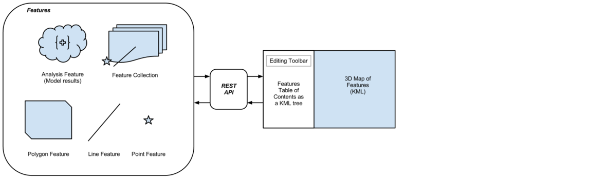

.. Madrona Decision Support Tool documentation master file, created by sphinx-quickstart on Tue Jun  9 12:49:50 2009.
   You can adapt this file completely to your liking, but it should at least
   contain the root `toctree` directive.

Madrona Decision Support Tool Documentation
############################################

Madrona is a framework for building web-based decision support tools for open and participatory spatial planning. Madrona offers a simple, flexible and powerful means of gathering expertise from resource managers, scientists, stakeholders and public in a process of collaborative decision making.

Madrona is a python module providing a set of reusable apps for the django web framework. Using madrona, one can extend the framework for any sort of collaborative spatial planning process or decision support tool. Madrona provides the building blocks while allowing you to focus on data and models that are important to your decision making process.

Table of Contents
=================

.. toctree::
   :maxdepth: 2
   
   overview 
   installation
   tutorial 
   apps
   topics
   
API
===

    * `Python API Documentation <api/index.html>`_ (automatically generated by epydoc)
    * `Javascript Documentation <jsdocs/index.html>`_ (automatically generated by jsdoc)
    * `Test Coverage <coverage/index.html>`_ (automatically generated by coverage/django unit tests)
    * `Pylint outputs <pylint.html>`_ (automatically generated by pylint)
   
Indices and tables
==================

* :ref:`genindex`
* :ref:`modindex`
* :ref:`search`
