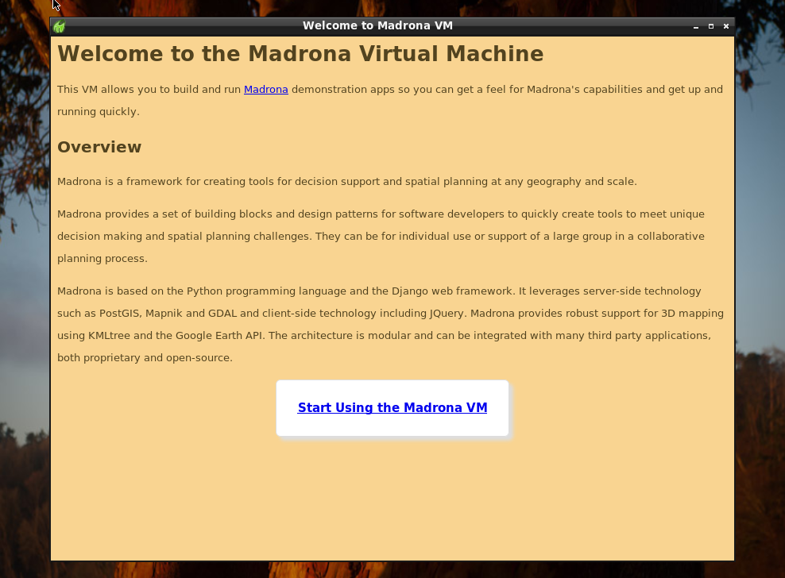
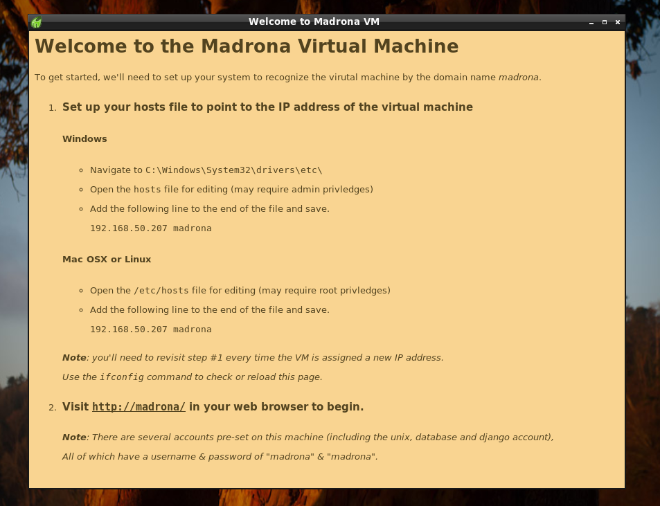
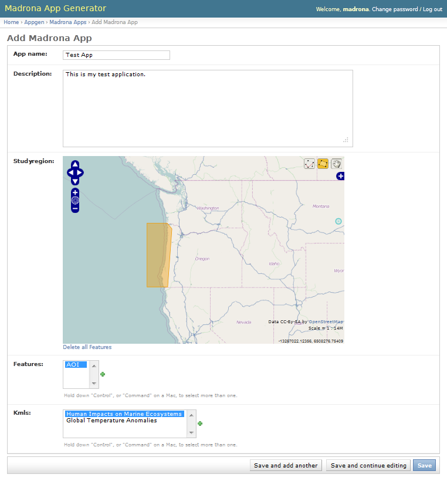
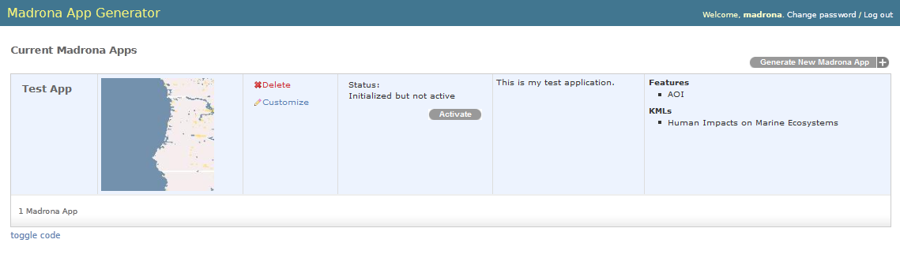
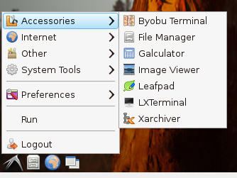

.. _appgen_project:

Using the Madrona Virtual Machine 
=========================================================

This tutorial will walk through:

1. Downloading and installing the Madrona virtual machine
2. Creating an initial app using the graphical "Madrona App Generator"
3. Customizing the app

.. note:: You'll need a Windows or OSX system that can run the Google Earth Web Plugin

Downloading and installing the virtual machine
###############################################

First we need to get the Madrona VM up and running on your machine:

1. Download and install `VirtualBox <http://www.virtualbox.org/>`_ for your operating system

2. Download the `Madrona Virtual Machine <https://s3.amazonaws.com/madrona_vm/madrona_virtual_v1.ova>`_ (.ova format; ~ 1GB) 

3. Navigate to File > Import Applicance > and select the madrona_virtual_v1.ova file.

4. Set up networking. In the VM Manager, 

    * select the Madrona VM 
    * click the "Settings" icon
    * click on "Network"
    * check that your network card is listed in the "Name" field
    * click "OK"

5. Start the virtual machine and click "Start Using the Madrona VM"

6. Follow the instructions on screen to set up networking 

.. note:: TODO: Add tutorial link (direct link to the 'Creating the initial demo app' section below) to the Welcome page.

Creating the initial demo app 
###############################

Now that your virtual machine is up and running and your networking is setup, access the app generator from a web browser in your *host* operatings system (not the VM).

.. note:: TODO: Why access it from your host system?  The demo uses the Google Earth Web Plugin which isn't supported for Linux.  Explain how a user might add a new Feature or KML through the AppGen interface. 

1. Open the URL ``http://madrona/``

2. Sign in. The username and password is `madrona` / `madrona`.

3. Click ``Generate New Madrona App`` to begin.

4. Provide the App with a name, we'll be using "Test App" throughout this tutorial.

5. Enter an optional description.

6. Draw a study region on the map.  The studyregion is used to define the geographical extent of your project.  For best results, draw a smaller region.

7. Select the 'AOI' feature or create your own by clicking the '+' button.  Features are spatial entities that the user will be able to draw, edit and share with other people.  Select as many features as you want. 

8.  Select one or more KML data layers to make available to your users.  Click the "+" button to add your own KML file if you know the URL.

9. Click ``Save``.

Once you've clicked ``Save``, and you'll see a summary of your app.
Next, Click ``Initialize`` ... this step can take a minute so be patient. When ready, click the ``Activate`` button to begin.

.. note:: What's going on under the hood? This graphic interface is just running some simple commands that can be viewed by using the `toggle code` link.

Click ``Go To App`` (will take you to ``http://madrona:81/``) and you should see the application you just created. 

.. note:: TODO: Provide additional information (or a link) covering the tool itself.  I.E. Instructions for signing in, creating an AOI, a Folder, and dragging the AOI into the Folder.  Could also cover Data Layer and Tools panels as well as Export and Edit...

Viewing and editing the generated code
---------------------------------------

Now we'll go back to the Virtual Machine window to see the code that was generated through this process. 

The weird little icon in the lower-left is your "Start" button. From there you can access ``Start > Accessories`` and open:

1. ``LXTerminal`` (a command line terminal)
2. ``File Manager`` (for browsing and editing files)

In the LXTerminal window, type::

    cd /usr/local/userapps/testappDemoProject/testappdemoproject

Using the File Manager, navigate to that same directory and go into the ``testapp`` folder. Now you're ready to begin customizing the app.

.. include:: tutorial_customize_appgen.rst
    
