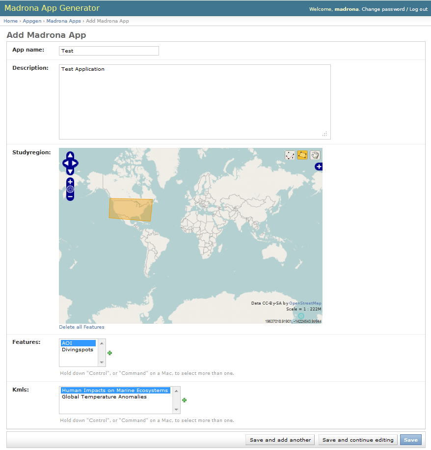
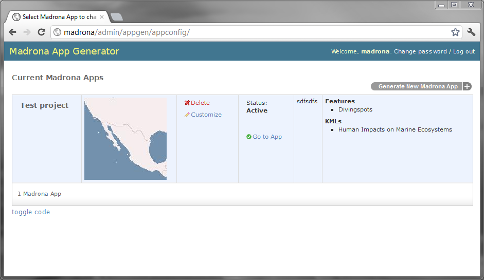

.. _appgen_project:

Using the Madrona Virtual Machine 
=========================================================

This tutorial is intended for users of the Madrona Virtual Machine who want to use the graphical "Madrona App Generator" setup tool to get started. 
We'll walk through:

1. Downloading and installing the virtual machine
2. Creating the initial demo app 
3. Customization

Downloading and installing the virtual machine
###############################################

1. Download and install `VirtualBox <http://www.virtualbox.org/>`_

2. Download the `Madrona Virtual Machine <https://s3.amazonaws.com/madrona_vm/madrona_virtual_v1.ova>`_ (.ova format; ~ 1GB) 

3. Navigate to File > Import Applicance > and select the madrona_virtual_v1.ova file.

4. Set up networking. In the VM Manager, 

    * select the Madrona VM 
    * click the "Settings" icon
    * click on "Network"
    * check that your network card is listed in the "Name" field
    * click "OK"

5. Start the virtual machine and click `Start Using the Madrona VM`

.. image:: initvm.png

6. Follow the instructions on screen to set up networking 

.. image:: hostsvm.png

Creating the initial demo app 
###############################

In your *host* web browser, open the URL ``http://madrona/`` and sign in. The username and password is `madrona`/`madrona`.

Click ``Generate New Madrona App`` to begin:

Click ``Save`` and you'll see a summary of your app.
Next, Click ``Initialize`` ... this step can take a minute so be patient. When ready, click the `Activate` button to begin.

Click ``Go To App`` (will take you to ``http://madrona:81/``) and you should see the application you just created. 

.. note:: What's going on under the hood? This graphic interface is just running some simple commands that can be viewed by using the `toggle code` link.

Viewing and editing the generated code
---------------------------------------

Now we'll go back to the Virtual Machine window to see the code that was generated through this process. 

The wierd little icon in the lower-left is your "Start" button. From there you can access ``Start > Accessories`` and open:

.. image:: terminal.png

1. ``LXTerminal`` (a command line terminal)
2. ``File Manager`` (for browsing and editing files)

In the LXTerminal window, type::

    cd /usr/local/userapps/testDemoProject/testdemoproject
    sudo chmod 777 *

.. note:: This last command will set the file permission so you can edit them; this may require you to enter a password. Type `madrona` if prompted.

And navigate to that same directory in the File Manager and go into the ``test`` folder. Now you're ready to begin customizing the app.

.. include:: tutorial_customize_appgen.rst
    
