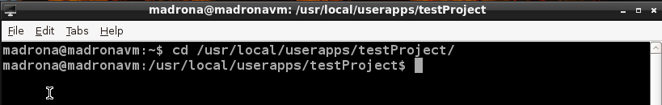

.. _appgen_project:

Customizing your Madrona VM demo 
=========================================================

This tutorial is intended for users of the Madrona Virtual Machine who have already used the "Madrona App Generator" to generate a demo app using the graphical setup tool. 

.. image:: appgen.png

Go to the virtual machine and open a terminal window (Start > Accessories > LXTerminal)

.. image:: terminal.png

Navigate to to your generated code and begin customization (replace `testProject` with the name you specified).

From here, you can begin customizing the code. Start from the :ref:`Customization <tutorial_customizing>` section.
