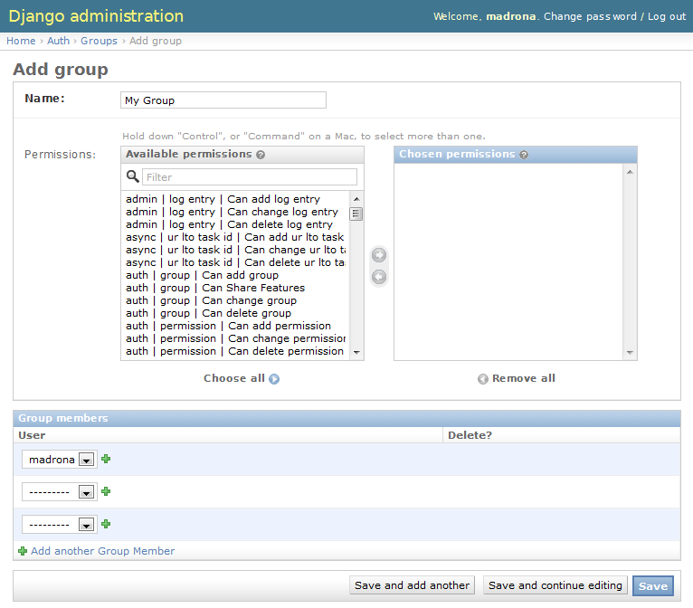

Customizing the Madrona project 
##################################

While the above shows the basic layout of a simple madrona app, we'll now dive in and begin customizing it.

Verbose name 
---------------------
The first obvious step is to change how our feature name appears on screen. We can supply custom text using the ``verbose_name`` option::

    @register
    class MyAreasOfInterest(PolygonFeature):
        description = models.TextField(null=True, blank=True)
        class Options:
            form = 'example.forms.MyAreasOfInterestForm'
            verbose_name = 'Areas that interest me'

For other options, see the :ref:`Feature options docs<feature_options>`.

Generating custom reports
-------------------------
The default template for the AOI feature just prints out some basic details. In order to customize it, open ``templates/myareasofinterest/show.html``. There you will see a django html template responsible for creating the attributes page. 

Each feature get's passed to the template as the variable ``instance``. Any attributes, properties and methods that exist on the feature model instances can be accessed via template variables. For example, to get the polygon area, you could use the following template substitution::

    {{instance.geometry_final.area}}

You could also define a custom property on your AOI model...::

    @register
    class MyAreasOfInterest(PolygonFeature):
        description = models.TextField(null=True, blank=True)
        class Options:
            form = 'example.forms.MyAreasOfInterestForm'
            verbose_name = 'Areas that interest me'

        @property
        def acres(self):
            area_meters = self.geometry_final.area 
            conversion = 0.000247105381 
            area_acres = area_meters * conversion
            return area_acres

... and use the following in your template::

    
Acreage is {{instance.acres}}

The reporting can get as detailed and complex as your needs require and can leverage GeoDjango geometry operations as well as any spatial analysis supported by Python. 

About page
-----------
Open the ``templates/news/about.html`` page. The default landing page is just a placeholder; here you can put any 
html description of your project or high-level documentation that you want the user to see when they first view the site::

    
    <h1> About </h1>
    
 This app exists as an example to highlight some of the functionality
    of the Madrona framework. 

Customizing KML styling
-------------------------

Every feature class has a default ``kml`` and ``kml_style`` properties which defines the KML representation of that feature. If you want to customize the look and behavior of your map features, you can override the kml property in your feature model. In ``example/models.py``::

    @register
    class MyAreasOfInterest(PolygonFeature):
        description = models.TextField(null=True, blank=True)
        class Options:
            form = 'example.forms.MyAreasOfInterestForm'
            verbose_name = 'Areas that interest me'

        @property
        def kml(self):
            return """
            <Placemark id="%s">
                <name>%s</name>
                <styleUrl>#%s-default</styleUrl>
                <ExtendedData>
                    <Data name="name"><value>%s</value></Data>
                    <Data name="dsc"><value>%s</value></Data>
                    <Data name="acres"><value>%s</value></Data>
                </ExtendedData>
                %s 
            </Placemark>
            """ % (self.uid, 
                self.name, 
                self.model_uid(),
                self.name, self.date_modified, self.acres
                self.geom_kml)

        @property
        def kml_style(self):
            return """
            
            """ % self.model_uid()

The above will give us KML placemarks with a different popup balloon (showing Name, Description and Acres) 
and change polygon styling to green fill. 

Ultimately, whatever you can do with `KML <https://developers.google.com/kml/documentation/kmlreference>`_ , you can do with your feature's KML representation. 
However, there are some important guidelines to follow;  For more information, see the :ref:`kmlapp documentation <kmlapp>`.

Group Collaboration
---------------------------------

Madrona provides a robust mechanism for sharing features between users. By default, all features you create under a single account are accessible by that user alone. But `users` can be made members of `groups` and can choose to share features with group members who can then view them, copy them, share them back with revisions, etc. This allows for truely collaborative multi-user workflows while maintaining privacy of data. 

The first step is to use Django's admin site to create users and groups.

1. Navigate to  ``http://<HOST_OR_IP_ADDRESS>:<PORT>/admin/auth/`` and click ``+ Add`` next to Groups. Give the group a name, "My Group", and add the "madrona" user to it, and click ``Save``:

2. Of course you, the "madrona" user, are the only member of this group at the moment! Go back to  ``http://<HOST_OR_IP_ADDRESS>:<PORT>/admin/auth/`` and click ``+ Add`` next to `Users` and follow the instructions on-screen to create another user and add them to the ``My Group`` group.

3. Finally, at the command line prompt, enable sharing for "My Group" by this command::

    python manage.py enable_sharing --all

Back in the application, you should now be able to share features with other users through the ``Edit`` > ``Share`` menu item and view shapes that others have shared in the ``Shared with Me`` tab.

Handling geometries through manipulators
----------------------------------------

The :ref:`manipulators <manipulators>` app provides ways to validate user-drawn geometries and make sure they conform to rules that you define. 
For example, you may want to limit user-drawn shapes to be within the study region. For this case, there is a built in manipulator called ``ClipToStudyRegion`` which will, as the name suggests, clip a user-drawn shape to the coundary of the study region::

    @register
    class MyAreasOfInterest(PolygonFeature):
        description = models.TextField(null=True, blank=True)
        class Options:
            form = 'example.forms.MyAreasOfInterestForm'
        verbose_name = 'Areas that interest me'
        manipulators = [ 'madrona.manipulators.manipulators.ClipToStudyRegion' ]

You can also choose from several other built-in manipulators, define custom manipulators or make them optional. For more information, see the :ref:`manipulators documentation <manipulators>`.

Managing basemaps and KML datasets
------------------------------------
Base data layers are managed using a single KML file called the `public layers list`. If you defined KML layers 
when setting up your initial app, the layers list will be available at 
``http://<HOST_OR_IP_ADDRESS>:<PORT>/layers/public/``. Download that file, save as ``public.kml``, 
and open for editing. You'll see that it is a standard KML file with `NetworkLink`s to the base data layers.  We can modify it by adding another KML NetworkLink ::

    <NetworkLink id="global-marine">
        <name>Global Marine</name>
        <visibility>0</visibility>
        <Link>
        <href>http://ebm.nceas.ucsb.edu/GlobalMarine/kml/marine_model.kml</href>
        </Link>
    </NetworkLink>

Once we've modified the public kml, browse to admin interface at ``http://<HOST_OR_IP_ADDRESS>:<PORT>/admin/layers/publiclayerlist/add/`` and use it to upload the new KML file. After refreshing your browser cache, you should see the new KML avaible in the layers panel.

For more information, see the :ref:`layers documentation <layers>`.

Custom Links: Extending the API
---------------------------------
Many default API actions are defined out-of-box for Madrona Features (Create, Edit, Delete, KML download, etc.). If you want to provide other methods of accessing your features, Madrona provides a link option to extend the API. 

For example, let's say we want to provide a simple text file download for your area of interest. This would involve two steps: 

1. Add a link to your feature Options in ``example/models.py``::

    @register
    class MyAreasOfInterest(PolygonFeature):
        description = models.TextField(null=True, blank=True)
        class Options:
            form = 'example.forms.MyAreasOfInterestForm'
            verbose_name = 'Areas that interest me'
            manipulators = [ 'madrona.manipulators.manipulators.ClipToStudyRegion' ]
            links = (
                related('Text file',
                    'examples.views.aoi_text',
                    select='single multiple',
                    type='text/csv'
                ),
            )

2. Create a view to handle the creation of text files for one or more features. Open ``example/views.py`` and add the following function::
   
    def aoi_text(request, instances):
        text = "Name, Description, Acres\n"
        for f in instances:
            text += "%s, %s, %f\n" % (f.name, f.description, f.acres)
        return HttpResponse(text)

Now restart the application, clear the cache and you should see ``Text File`` as an option in the download menu.

.. note:: There are many :ref:`default links <default_links>` provided by madrona - just think of all the work you'd have to do to a) manually create the views and urls to handle them and b) tweak the javascript and html to handle all of those views. Madrona just does it for you... nice, huh!  

For more information about extending the API through links and views, consult the :ref:`Features documentation <feature_links>` 

Next Steps
##############

See the documentation in the following sections to customize Madrona as 
needed:

.. toctree::
   :maxdepth: 1
   
   features
   studyregion
   deployment
   layers
   managing_users
   migration
   manipulators
   staticmap
   sharing_configuration
   kml_configuration
   template_customization
   
The setup this guide has walked through only specifies how to run the django
development server. To setup a public facing website using Apache, consult the
:ref:`deployment` notes.
